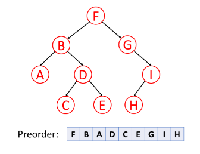
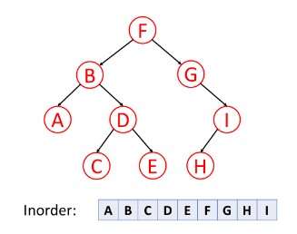
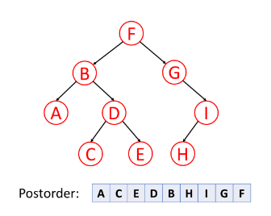

## Traverse a Tree

### Pre-order Traversal
Pre-order traversal is to visit the root first. 
Then traverse the left subtree.

### In-order Traversal
In-order traversal is to traverse the left subtree first. 
Then visit the root. Finally, traverse the right subtree.

### Post-order Traversal
Post-order traversal is to traverse the left subtree first. 
Then traverse the right subtree. Finally, visit the root.

