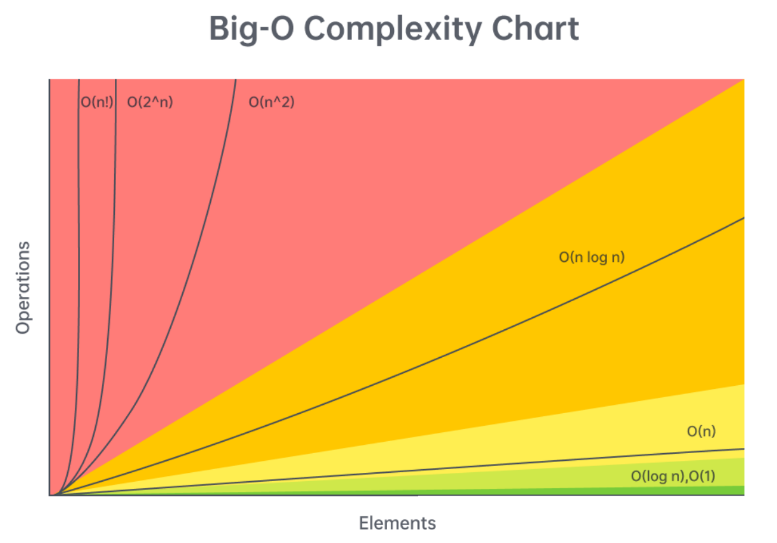
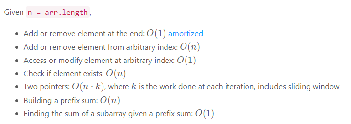
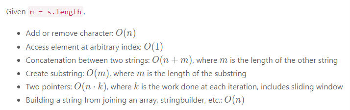
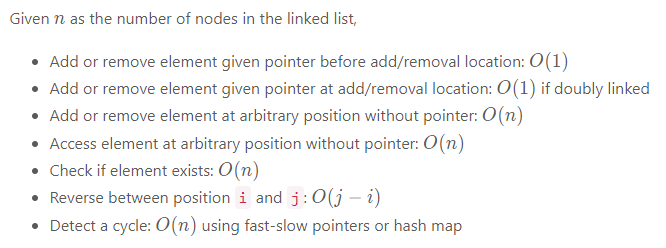
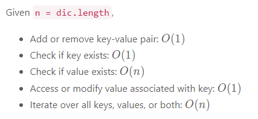
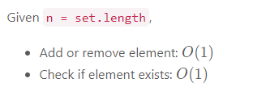
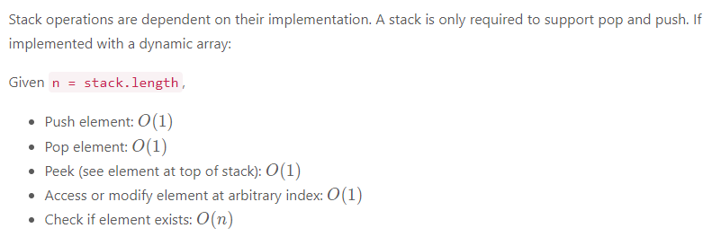
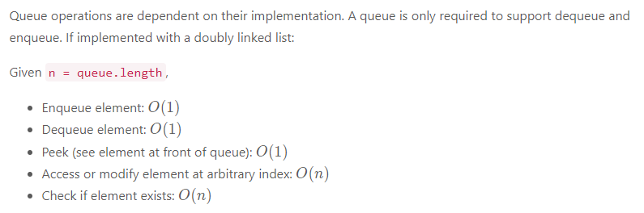
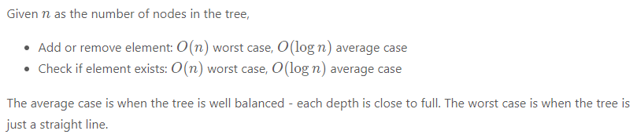

## Time complexity (Big O) cheat sheet

## Time complexity by data structures

### Arrays (dynamic array/list)

### Strings (immutable)

### Linked Lists

### Hash table/dictionary

### Set

### Stack

### Queue

### Binary search tree
